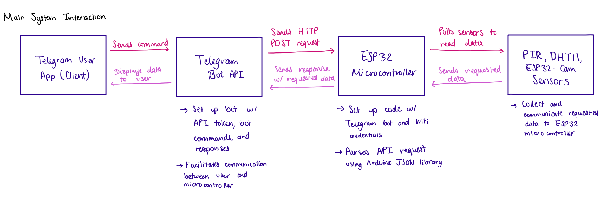
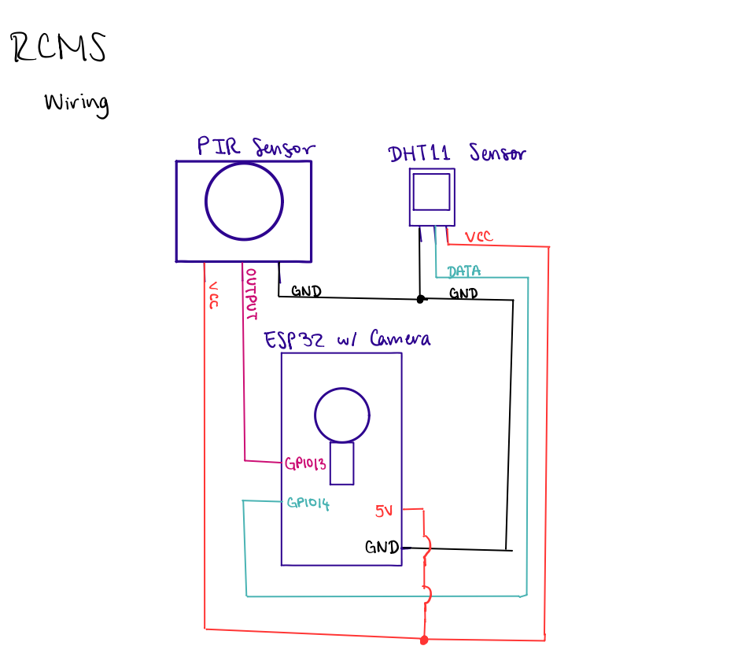

# Remote Control Monitoring System 

#### Description
* Implements real-time communication between an ESP32 w/ on on-board camera, and a Telegram Bot API, using peripherals like a PIR sensor for motion detection, a DHT11 Temperature & Humidity Sensor for data collection, and the ESP32-CAM for picture 
* Configures bidirectional communication with the Telegram Bot, allowing the user to send commands, and recieve the requested data through the HTTP POST-Response method
* Uses the Arduino JSON library to allow the ESP32 to parse the bot's request and collect requested information from peripherals
* Facilitates interrupt handling for effective motion detection with the PIR sensor, using WiFi connectivity to allow the ESP32 full IoT capabilities in sending the requested information back to the Telegram Bot (and consequently, the user)

#### Functional Software Diagram

##### Wiring Diagram

#### Resources

* [ESP32-CAM with Telegram](https://randomnerdtutorials.com/esp32-cam-shield-pcb-telegram/)